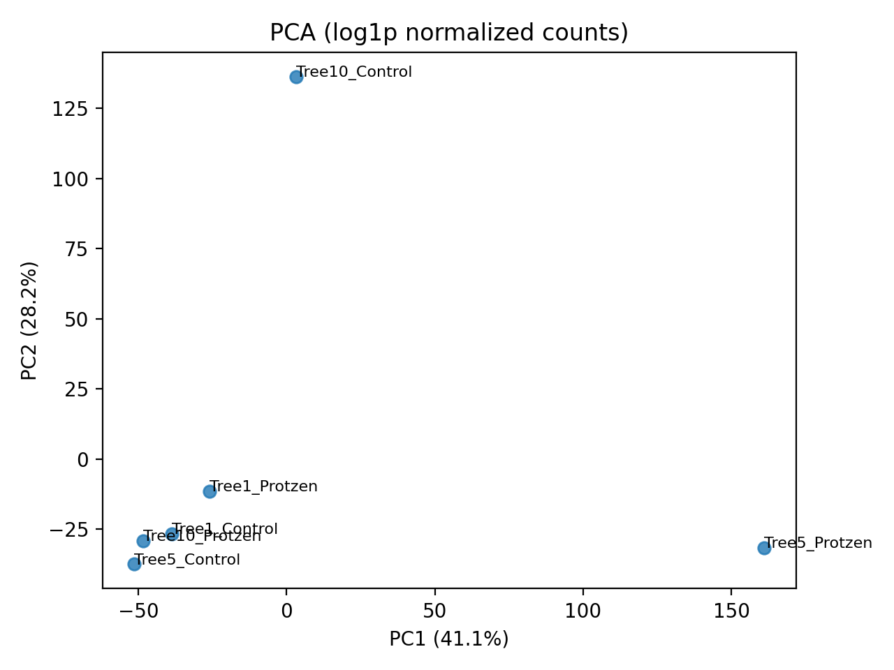
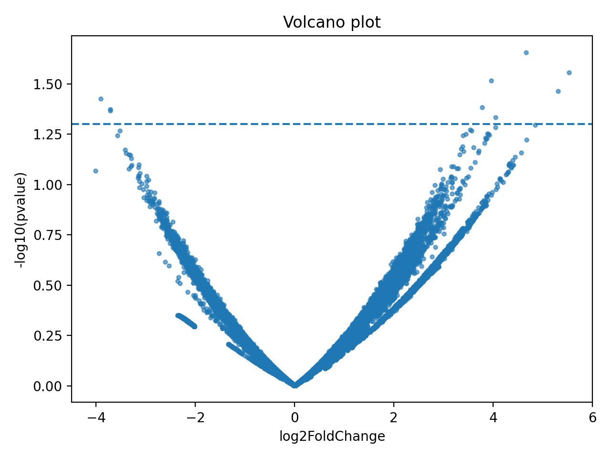

# rnaseq-python-pipeline

> Reproducible RNA-seq analysis in Python — from raw counts to
> differential expression and pathway enrichment.

**Language:** Python 3.x &nbsp;|&nbsp;
**DE Engine:** PyDESeq2 &nbsp;|&nbsp;
**Enrichment:** gseapy (GSEA preranked) &nbsp;|&nbsp;
**Tests:** pytest

---
## Results preview

The pipeline produces publication-ready plots and ranked gene tables
directly from raw count input.

**PCA — sample separation by condition (Control vs Protzen)**


> PC1 (41.1%) cleanly separates the two conditions across biological
> replicates, confirming consistent transcriptomic response.

**Volcano plot — differential expression landscape**


> Genes above the significance threshold (dashed line, p < 0.05)
> and with |log2FC| > 2 are candidates for downstream pathway analysis.

**Top 10 differentially expressed genes (by |log2FC|)**

| Gene ID | baseMean | log2FC | padj |
|---|---|---|---|
| STRG.32921 | 22.7 | 5.53 | 0.028 |
| STRG.31388 | 10.8 | 5.31 | 0.034 |
| STRG.31523 | 9.04 | 4.85 | 0.051 |
| STRG.32898 | 7.24 | 4.67 | 0.060 |
| STRG.28791 | 16.2 | 4.67 | 0.022 |
| STRG.33050 | 6.91 | 4.56 | 0.070 |
| STRG.31864 | 10.1 | 4.44 | 0.073 |
| STRG.33346 | 5.30 | 4.40 | 0.080 |
| STRG.32218 | 5.50 | 4.40 | 0.080 |
| STRG.32461 | 7.51 | 4.40 | 0.076 |

---

## What this pipeline does

Most RNA-seq analyses live in fragile notebooks or R scripts
that break when someone else runs them on different data.

This pipeline is different. It is:

- **Config-driven** — swap datasets by editing a YAML file, not the code
- **Tested** — pytest coverage across sample loading, validation, and DE logic
- **Structured as a real Python package** — clean `src/` layout,
  importable modules, dependency-pinned via `pyproject.toml`
- **End-to-end** — from raw count matrix to enrichment plots
  in a single reproducible workflow

---

## Pipeline overview
```
Raw Counts (TSV)
      │
      ▼
 Sample Validation ──► rejects invalid/duplicate samples
      │
      ▼
 Differential Expression (PyDESeq2)
      │
      ▼
 Gene Ranking (signed log-fold change scores)
      │
      ▼
 ID Mapping  STRG → TAIR (Arabidopsis)
      │
      ▼
 GSEA Preranked (gseapy) against GO Biological Process gene sets
      │
      ▼
 Results: enrichment tables + pathway plots
```

---

## Repository structure
```
src/              # Python package (pipeline logic)
config/           # YAML config + sample sheet (samples.tsv)
scripts/          # Runnable entry points (de_run.py, run_gsea.py, ...)
tests/            # pytest test suite
data/             # Input data (not committed)
results/          # Generated outputs (not committed)
```

---

## Quick start

**Requirements:** Python 3.10+, Windows (PowerShell) or Linux
```powershell
# Clone and set up environment
git clone https://github.com/arash-rahmani/rnaseq-python-pipeline
cd rnaseq-python-pipeline
python -m venv .venv
.\.venv\Scripts\Activate.ps1
pip install -U pip
pip install -r requirements.txt
```

**Run differential expression:**
```powershell
python scripts/de_run.py
```

**Run GSEA enrichment:**
```powershell
python scripts/run_gsea.py
```

**Run tests:**
```powershell
pytest tests/
```

---

## Key design decisions

**Why PyDESeq2 instead of R/DESeq2?**
Full Python stack — no R dependency, easier to integrate into
automated pipelines, reproducible across environments.

**Why config-driven execution?**
Separating data config from code logic means the pipeline
runs on new datasets without touching source files.

**Why pytest on a research pipeline?**
Academic code breaks silently. Tests catch invalid sample sheets,
mismatched column names, and edge cases before they corrupt results.

---

## Biological context

This pipeline was developed and validated on transcriptome data
from *Fagus sylvatica* (European beech), analysing carbon-harvesting
responses via RNA-seq. The GSEA step uses GO Biological Process
gene sets to identify enriched pathways from ranked differential
expression results.

---

## About

Built by [Arash Rahmani](https://github.com/arash-rahmani) —
M.Sc. Bioinformatics, Julius-Maximilians-Universität Würzburg.
[LinkedIn](https://linkedin.com/in/arash-rahmani-544684242)
